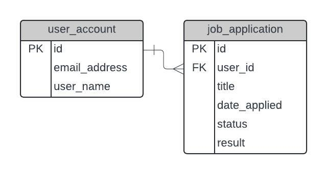

# Design of the Database

## Introduction

Above is an ER diagram of the database.

Job Tracker has the following features :

1. Users can sign in with Oauth
2. Users can create records that track job applications

Therefore, I created two tables : the user_account and job_application table.

## Design

The user_account and job_application tables follow a standard one to many relationship. Where a user can create multiple job applications to track.
