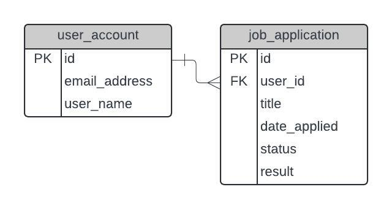

# JobTracker - Backend

The backend of JobTracker is a REST API that uses Node.js and Express. The structure of the API largely follows the format of Part 4 of the [Full Stack open](https://fullstackopen.com/en/) tutorial.

## Server Directory

1. diagrams : Holds images of ER Diagrams of the database
2. sql : Contains the SQL code used to generate tables of the Database
3. src : Source directory of the Node.js API

## Src Directory

The src directory contains all files of the API. You can read more about how it's designed and structured [here](https://github.com/KyleHu14/job-tracker/tree/main/server/src).

## Design of the Database

The user_account and job_application tables follow a standard one to many relationship. Where a user can create multiple job applications to track.
